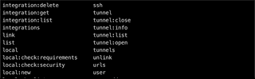

# Symfony binary completion for Zsh



This is a [Oh My Zsh](https://ohmyz.sh/) plugin that provides completion for the [Symfony binary](https://symfony.com/doc/current/setup/symfony_server.html) (also knows as Symfony local web server).

You can alse use the completion without *Oh My Zsh*.

## Completion

This plugin provide completion for the following commands:  

- `symfony`
- `symfony console`
- `symfony composer`

## Installation

There are two ways to install the Symfony binary completion; depending on whether you have *Oh My Zsh* or not.

### With *Oh My Zsh*

First, retrieve the plugin:
``` 
$ curl https://codeload.github.com/l-vo/ohmyzsh-sfbinary/tar.gz/latest > latest.tar.gz && tar -xzf latest.tar.gz && mv ohmyzsh-sfbinary-latest $ZSH_CUSTOM/plugins/sfbinary && rm latest.tar.gz
```
(You can also manually download `https://github.com/l-vo/ohmyzsh-sfbinary/archive/latest.zip`, unzip it, rename it as `sfbinary` and move it to `$ZSH_CUSTOM/plugins`)

Then add it to the plugins array in your `~/.zshrc` file:
```
plugins=(... sfbinary)
```

Finally source `.zshrc` to take the changes in account:
```
source ~/.zshrc
```

(To update it from an older version, do `rm -rf $ZSH_CUSTOM/plugins/sfbinary` and repeat the previous steps)

### Without *Oh My Zsh*

First, retrieve the plugin:
```
$ cd ~
$ curl https://codeload.github.com/l-vo/ohmyzsh-sfbinary/tar.gz/latest > latest.tar.gz && tar -xzf latest.tar.gz && mv ohmyzsh-sfbinary-latest sfbinary && rm latest.tar.gz
```

Then add in your `~/.zshrc` file:
```
autoload -U compinit
compinit
source ~/sfbinary/sfbinary.plugin.zsh
```

Finally source `.zshrc` to take the changes in account:
```
source ~/.zshrc
```

(To update from an older version, do `rm -rf ~/sfbinary` and repeat the previous steps)

## Contributions
The shell commands used to retrieve the autocompletion list are probably not the best optimized. If you have better ideas to do that, pull requests are welcome 🙂.
